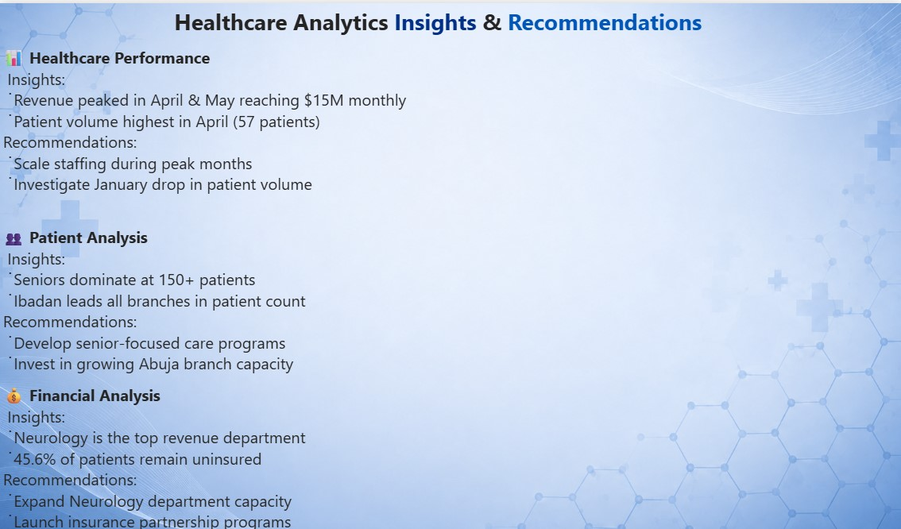
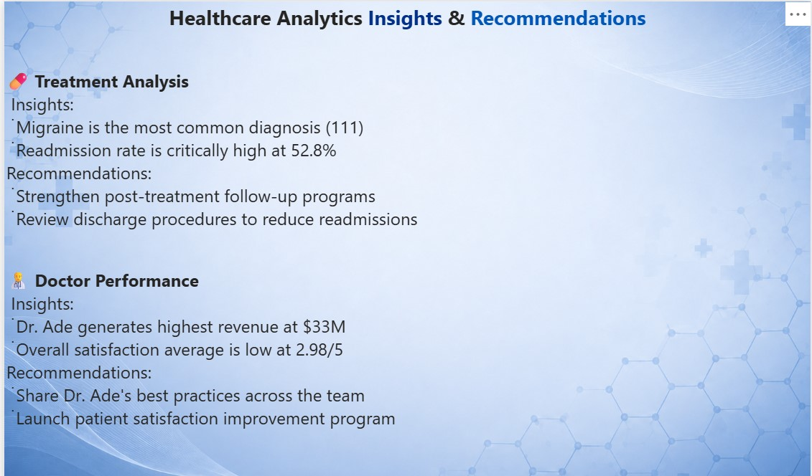

# 🏥 Healthcare Analytics Dashboard – Power BI

## 📖 Project Story
Hospitals collect huge amounts of data every day, but leaders often struggle to turn those numbers into clear decisions.  
This project analyzes **500 patient records across four Nigerian hospital branches** to uncover trends in patient demographics, treatment outcomes, financial performance, and doctor efficiency.  

The dashboard helps hospital management answer questions like:
- Which branch is performing best financially?
- How efficient are doctors compared to patient outcomes?
- Where are costs rising, and why?

**Goal:** Use data to improve patient care while keeping hospital operations sustainable.

---

## 🗂️ Dataset Information
- Patients: 500  
- Branches: 4  
- Report Pages: 5  

**Data Dictionary**
- Patient_ID → Unique identifier for each patient  
- Age → Patient’s age in years  
- Gender → Male/Female  
- Branch → Hospital branch code (A, B, C, D)  
- Treatment_Type → Type of treatment (Surgery, Consultation, Therapy, etc.)  
- Treatment_Duration → Number of days/hours for treatment  
- Revenue → Amount billed for treatment (₦)  
- Doctor_ID → Unique identifier for attending doctor  
- Outcome → Treatment result (Successful, Ongoing, Failed)  
- Visit_Date → Date of patient’s hospital visit  

---

## 🎯 Key Performance Indicators (KPIs)
- **Total Patients Served** → Shows how many people the hospital reached.  
- **Revenue Generated** → Indicates the hospital’s financial health.  
- **Average Treatment Cost** → Helps management see if care is affordable or too expensive.  
- **Doctor Efficiency Score** → Balances how many patients a doctor sees with how successful their treatments are.  

---

## 🔧 Process
### Data Cleaning
- Removed duplicate patient records  
- Filled missing values in Age and Revenue  
- Standardized branch codes (A, B, C, D)  
- Created calculated columns for treatment duration and cost per patient  

### Analysis Steps
1. Patient demographics (age, gender)  
2. Treatment outcomes across branches  
3. Revenue trends and average treatment costs  
4. Doctor performance by workload vs. success rate  

---

## 📊 Findings
- **Branch B generated 40% of total revenue** → Driven by higher patient volume, suggesting their scheduling system is more efficient.  
- **Average treatment cost is ₦50,000** → Branch D’s costs are higher due to specialized surgeries, raising affordability concerns.  
- **Doctor efficiency varies widely** → Some doctors handle more patients but have lower success rates, which could affect patient trust.  

---

## 💡 Recommendations
- Replicate **Branch B’s scheduling system** across other branches to improve throughput.  
- Investigate **Branch D’s higher treatment costs** to ensure they’re justified by outcomes.  
- Provide **training for doctors with lower efficiency scores** to balance workload and improve patient success rates.  

---

## 📷 Dashboard Snapshots

Here are the key pages from the Healthcare Analytics Dashboard:

  
*Executive overview of hospital performance across all branches.*

  
*Breakdown of patient demographics and visit trends.*

  
*Comprehensive overview of revenue, treatment costs, and patient distribution across departments and hospital branches.*

  
*Treatment outcomes and average duration by type.*

  
*Doctor workload and efficiency scores.*

  
*Summary of the most important findings.*

  
*Actionable recommendations based on the analysis.*

---

## 🌍 Impact
This project shows how analytics can improve healthcare management by reducing costs, improving doctor efficiency, and enhancing patient outcomes. It highlights not just technical skills, but the ability to turn data into real decisions.

---

## 👤 Author
**Oluwatosin Babatunde Alaiya**  
Data Analyst – Power BI • Excel • SQL • Python  
[GitHub](https://github.com/tosinalaiya) · [Upwork](https://upwork.com/freelancers/tosinalaiya)
